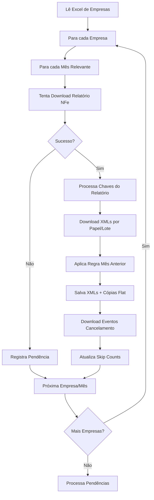
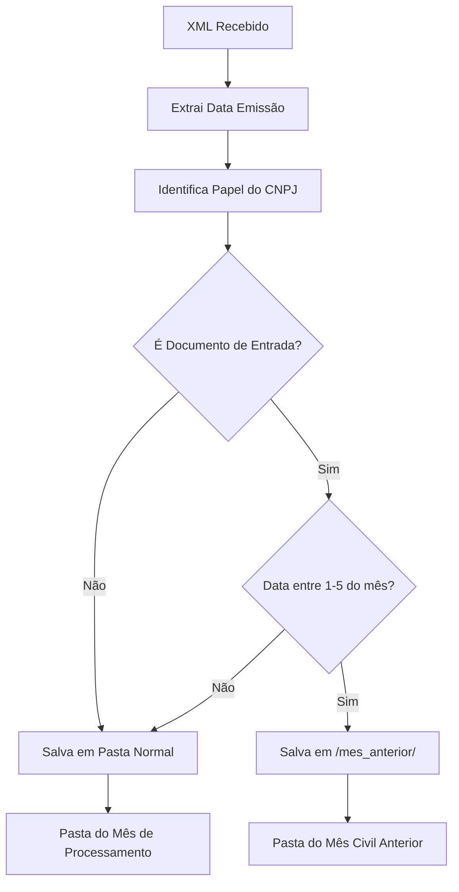

# Arquitetura Técnica - Sistema de Download XML SIEG

## 📋 Índice

1. [Visão Geral da Arquitetura](#visão-geral-da-arquitetura)
2. [Componentes Principais](#componentes-principais)
3. [Fluxos de Dados](#fluxos-de-dados)
4. [Padrões de Design](#padrões-de-design)
5. [Gerenciamento de Estado](#gerenciamento-de-estado)
6. [Sistema de Transações](#sistema-de-transações)
7. [Integrações Externas](#integrações-externas)
8. [Arquitetura de Armazenamento](#arquitetura-de-armazenamento)

---

## 🏗️ Visão Geral da Arquitetura

### Arquitetura Modular
```
┌─────────────────────────────────────────────────────────────┐
│                     ORCHESTRATOR                             │
│                     (app/run.py)                            │
└─────────────────┬───────────────────────────────────────────┘
                  │
        ┌─────────┼─────────┐
        │         │         │
        ▼         ▼         ▼
┌─────────────┐ ┌─────────────┐ ┌─────────────┐
│  API CLIENT │ │ FILE MANAGER│ │STATE MANAGER│
│             │ │             │ │             │
│ • Rate Limit│ │ • XML Save  │ │ • Skips     │
│ • Retries   │ │ • Directory │ │ • Pendencies│
│ • Auth      │ │ • SharePoint│ │ • Migration │
└─────────────┘ └─────────────┘ └─────────────┘
        │                │               │
        ▼                ▼               ▼
┌─────────────┐ ┌─────────────┐ ┌─────────────┐
│TRANSACTION  │ │  REPORT     │ │  LOGGING    │
│MANAGER      │ │  PROCESSOR  │ │  SYSTEM     │
│             │ │             │ │             │
│ • Atomic    │ │ • Validation│ │ • Structured│
│ • Rollback  │ │ • Parsing   │ │ • Multi-file│
│ • Audit     │ │ • Keys      │ │ • Rotation  │
└─────────────┘ └─────────────┘ └─────────────┘
```

### Princípios Arquiteturais

1. **Resiliência**: Sistema preparado para falhas temporárias de API
2. **Atomicidade**: Transações garantem consistência de dados
3. **Rastreabilidade**: Estado persistente permite recuperação
4. **Modularidade**: Responsabilidades bem separadas
5. **Extensibilidade**: Fácil adição de novos tipos de documentos

---

## 🔧 Componentes Principais

### 1. **Orchestrator (`app/run.py`)**
- **Responsabilidades**:
  - Coordenação geral do processo
  - Ciclo de processamento de empresas
  - Gerenciamento de pendências
  - Execução de loops contínuos

- **Funções Críticas**:
  ```python
  # Ciclo principal
  run_overall_process()  # Coordena execução completa
  run_process()          # Processa empresas do Excel
  
  # Tratamento de relatórios
  _try_download_and_process_report()  # Download + processamento
  
  # Download de XMLs
  _download_xml_batch()  # Lotes com controle de skip
  ```

### 2. **API Client (`core/api_client.py`)**
- **Características**:
  - Rate limiting: 30 req/min (2s entre requisições)
  - Retry automático: 3 tentativas com backoff
  - Session reutilizável com pools de conexão
  - Tratamento de respostas HTTP específicas

- **Endpoints Principais**:
  ```python
  # Download de relatórios consolidados
  baixar_relatorio_xml(cnpj, xml_type, month, year, report_type)
  
  # Download de XMLs individuais em lote
  baixar_xmls_empresa_lote(cnpj, xml_type, skip, take, ...)
  
  # Download de eventos (cancelamentos)
  baixar_eventos_empresa_lote(cnpj, tipo_documento, ...)
  ```

### 3. **State Manager (`core/state_manager.py`)**
- **Schema de Estado (v2)**:
  ```json
  {
    "processed_xml_keys": {
      "cnpj_norm": {
        "YYYY-MM": {
          "NFe|CTe": ["chave1", "chave2"]
        }
      }
    },
    "xml_skip_counts": {
      "cnpj_norm": {
        "YYYY-MM": {
          "NFe|CTe": {
            "Emitente|Destinatario|Tomador": skip_count
          }
        }
      }
    },
    "report_download_status": { /* status de relatórios */ },
    "report_pendencies": { /* relatórios para retry */ }
  }
  ```

- **Funcionalidades**:
  - Migração automática de schema v1 → v2
  - Gerenciamento de pendências com limite de tentativas
  - Thread-safe com locks
  - Skip counts para processamento incremental

### 4. **File Manager (`core/file_manager.py`)**
- **Operações de Arquivo**:
  - Leitura de Excel local/SharePoint
  - Salvamento de XMLs com estrutura hierárquica
  - Aplicação da "Regra Mês Anterior"
  - Contagem e validação de arquivos

- **Paths Configurados**:
  ```python
  PRIMARY_SAVE_BASE_PATH = "F:/x_p/XML_CLIENTES"
  FLAT_COPY_PATH = "\\\\172.16.1.254\\xml_import\\Import"
  CANCELLED_COPY_BASE_PATH = "\\\\172.16.1.254\\xml_import\\Cancelados"
  ```

---

## 📊 Fluxos de Dados

### Fluxo Principal de Processamento



### Fluxo de Recuperação de Pendências

```mermaid
graph TD
    A[Início Execução] --> B[Carrega State.json]
    B --> C[get_pending_reports()]
    C --> D{Há Pendências?}
    D -->|Sim| E[Para cada Pendência]
    E --> F[Tenta Download Relatório]
    F --> G{Sucesso?}
    G -->|Sim| H[resolve_report_pendency()]
    G -->|Não| I[Incrementa attempts]
    H --> J[reset_skip_for_report()]
    J --> K[Processa XMLs do Relatório]
    I --> L{attempts < MAX?}
    L -->|Não| M[Marca como MAX_RETRY]
    L -->|Sim| N[Próxima Pendência]
    K --> N
    M --> N
    N --> O{Mais Pendências?}
    O -->|Sim| E
    O -->|Não| P[Continua Processamento Normal]
    D -->|Não| P
```

### Fluxo da Regra "Mês Anterior"



---

## 🎯 Padrões de Design

### 1. **State Management Pattern**
- **Persistência**: Estado salvo em JSON para recuperação
- **Versionamento**: Schema migrations automáticas
- **Thread Safety**: Locks para concorrência
- **Incremental Processing**: Skip counts evitam reprocessamento
- **Dual-Key System** (CORRIGIDO 19/08/2025):
  - `skip_count`: Controla posição na API (quantos XMLs pular)
  - `processed_xml_keys`: Controla importação BI (previne re-cópias)
  - **IMPORTANTE**: São independentes e complementares

### 2. **Retry Pattern com Backoff**
```python
# Exemplo no API Client
retries = Retry(
    total=3,
    backoff_factor=1,  # 1s, 2s, 4s
    status_forcelist=(429, 500, 502, 503, 504)
)
```

### 3. **Transactional Pattern**
```python
# Atomic file operations
with TransactionManager() as tx:
    tx.stage_files(xml_files)
    tx.commit()  # Atomicamente move para destinos finais
```

### 4. **Circuit Breaker Pattern**
- **Pendencies**: Limita tentativas por relatório (MAX_PENDENCY_ATTEMPTS = 10)
- **Rate Limiting**: Previne sobrecarga da API
- **Graceful Degradation**: Continua processamento mesmo com falhas parciais
- **Company-level Circuit Breaker**: Pula empresas após 3 falhas consecutivas (MAX_CONSECUTIVE_FAILURES = 3)
  ```python
  # Implementado em app/run.py
  consecutive_failures = {}  # CNPJ -> contador de falhas
  if consecutive_failures.get(cnpj, 0) >= MAX_CONSECUTIVE_FAILURES:
      logger.warning("CIRCUIT BREAKER ATIVO")
      continue  # Pula empresa temporariamente
  ```

### 5. **Repository Pattern**
```python
# StateManager atua como repository para estado
state_manager.get_skip(cnpj, month, report_type, papel)
state_manager.update_skip(cnpj, month, report_type, papel, new_count)
```

---

## 💾 Gerenciamento de Estado

### Schema Evolution (v1 → v2)

**Problema**: Schema v1 não suportava múltiplos tipos de relatório
```json
// v1 (deprecated)
{
  "2024-05": {
    "12345678000199": {
      "NFe_Destinatario": 150,
      "CTe_Tomador": 75
    }
  }
}
```

**Solução**: Schema v2 com estrutura hierárquica
```json
// v2 (atual)
{
  "xml_skip_counts": {
    "12345678000199": {
      "2024-05": {
        "NFe": {"Destinatario": 150},
        "CTe": {"Tomador": 75}
      }
    }
  }
}
```

### Migração Automática
```python
def _migrate_v1_to_v2_skip_counts(self, loaded_data):
    # Detecta schema antigo e migra automaticamente
    # Preserva dados existentes
    # Atualiza schema_version para 2
```

### Gerenciamento de Pendências

**Estados de Pendência**:
- `pending_api_response`: Falha na comunicação com API
- `pending_processing`: Falha no processamento local
- `no_data_confirmed`: API confirmou ausência de dados
- `max_attempts_reached`: Esgotou tentativas

---

## 🔒 Sistema de Transações

### Transaction Manager (`core/transaction_manager.py`)

**Objetivo**: Garantir atomicidade em operações multi-arquivo

```python
# Estrutura de diretórios transacionais
transactions/
├── staging/          # Arquivos temporários
├── pending/          # Transações em andamento
└── completed/        # Auditoria de transações
```

**Processo Transacional**:
1. **Stage**: Arquivos preparados em diretório temporário
2. **Validate**: Verificação de integridade
3. **Commit**: Movimento atômico para destinos finais
4. **Audit**: Registro da transação para rastreabilidade

---

## 🔌 Integrações Externas

### 1. **API SIEG**
- **Base URL**: `https://api.sieg.com`
- **Autenticação**: API Key via query parameter
- **Rate Limit**: 30 req/min (self-imposed)
- **Endpoints**:
  - `/api/relatorio/xml` - Relatórios consolidados
  - `/BaixarXmls` - XMLs individuais
  - `/BaixarEventos` - Eventos de cancelamento

### 2. **SharePoint Integration**
```python
# Suporte a URLs do SharePoint para lista de empresas
def read_empresa_excel(excel_path_or_url):
    if is_url:
        response = requests.get(excel_path, timeout=60)
        excel_data = io.BytesIO(response.content)
        df = pd.read_excel(excel_data, engine='openpyxl')
```

### 3. **Network Storage**
- **Primary**: `F:/x_p/XML_CLIENTES` (storage principal)
- **Flat Copy**: `\\\\172.16.1.254\\xml_import\\Import` (BI/integração)
- **Cancelled**: `\\\\172.16.1.254\\xml_import\\Cancelados` (eventos)

---

## 🗂️ Arquitetura de Armazenamento

### Hierarquia de Diretórios
```
F:/x_p/XML_CLIENTES/
└── {ANO}/                           # ex: 2024
    └── {NUMERO}_{NOME_EMPRESA}/     # ex: 123_PAULICON_LTDA
        └── {MES}/                   # ex: 05
            ├── NFe/
            │   ├── Relatorio_NFe_{data}.xlsx
            │   ├── Emitente/
            │   │   └── *.xml
            │   ├── Destinatario/
            │   │   └── *.xml
            │   └── xml_files/       # Flat copy para BI
            │       └── *.xml
            ├── CTe/
            │   ├── Relatorio_CTe_{data}.xlsx
            │   ├── Emitente/
            │   ├── Destinatario/
            │   ├── Tomador/
            │   └── xml_files/
            ├── mes_anterior/        # Regra especial
            │   ├── NFe/Destinatario/
            │   └── CTe/Tomador/
            ├── Eventos/
            │   └── *.xml
            └── Resumo_Processamento_{empresa}_{mes}_{ano}.txt
```

### Estratégia de Backup Implícita
1. **Arquivos Principais**: Armazenados em `F:/x_p/XML_CLIENTES`
2. **Cópia Plana**: Duplicada em `\\\\172.16.1.254\\xml_import\\Import`
3. **Transações**: Auditoria completa em `transactions/completed/`
4. **Estado**: Persistido em `state.json` (versionado)

---

## 🔍 Padrões de Observabilidade

### Sistema de Logging Estruturado
- **Framework**: `loguru` para logs avançados
- **Níveis**: DEBUG, INFO, WARNING, ERROR, SUCCESS
- **Destinos**:
  - `logs/{timestamp}.log` - Log da execução atual
  - `logs/global.log` - Log consolidado
  - Console com cores (desenvolvimento)

### Métricas Implícitas
- **Skip Counts**: Indicam progresso de processamento
- **Pendency Counts**: Indicam saúde da integração
- **Transaction Logs**: Auditoria de operações
- **Report Status**: Mapeamento de sucessos/falhas por empresa/mês

---

## 🚀 Considerações de Performance

### Otimizações Implementadas
1. **Batch Processing**: XMLs baixados em lotes de 50
2. **Session Reuse**: Pool de conexões HTTP
3. **Memory Efficiency**: Streaming de arquivos Excel grandes
4. **Skip Logic**: Evita reprocessamento desnecessário
5. **Rate Limiting**: Evita throttling da API

### Gargalos Identificados
1. **Network I/O**: Dependente de latência para API SIEG
2. **Disk I/O**: Salvamento massivo em storage de rede
3. **XML Parsing**: Processamento CPU-intensivo para documentos grandes
4. **Memory Usage**: Carregamento de relatórios Excel grandes

---

## 📈 Escalabilidade

### Limitações Atuais
- **Single-threaded**: Uma empresa por vez
- **Rate Limited**: 30 req/min da API
- **Network Dependencies**: Storage de rede pode ser lento
- **Memory Bound**: Excel grandes podem causar picos de memória

### Oportunidades de Melhoria
1. **Paralelização**: Múltiplas empresas simultâneas (respeitando rate limit)
2. **Caching**: Cache inteligente de relatórios
3. **Batch Optimization**: Lotes dinâmicos baseados em performance
4. **Async Processing**: I/O assíncrono para network operations

---

*Documentação gerada automaticamente baseada na análise do código fonte.*
*Última atualização: 2025-08-01*