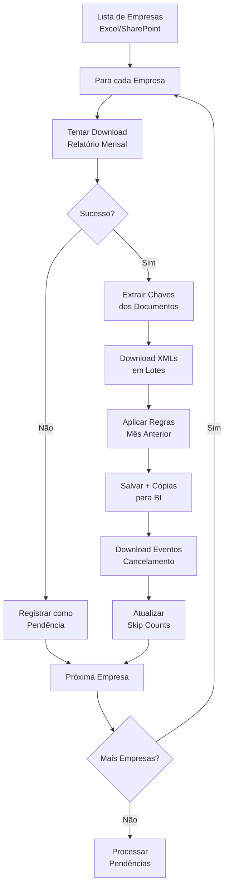

# Documentação Técnica - Sistema de Download XML SIEG

## 📋 Índice

1. [Visão Geral do Sistema](#visão-geral-do-sistema)
2. [Arquitetura e Componentes](#arquitetura-e-componentes)
3. [Fluxos de Processamento](#fluxos-de-processamento)
4. [Configuração e Execução](#configuração-e-execução)
5. [Integração com API SIEG](#integração-com-api-sieg)
6. [Gerenciamento de Estado](#gerenciamento-de-estado)
7. [Sistema de Arquivos e Storage](#sistema-de-arquivos-e-storage)
8. [Logging e Monitoramento](#logging-e-monitoramento)
9. [Deployment e Operações](#deployment-e-operações)
10. [Troubleshooting](#troubleshooting)

---

## 🎯 Visão Geral do Sistema

### Objetivo
Sistema automatizado para **download e organização** de documentos fiscais eletrônicos brasileiros (NFe/CTe) da API SIEG, processando listas de empresas e organizando XMLs em estrutura hierárquica para integração com sistemas BI.

### Características Principais
- ✅ **Processamento Incremental**: Evita reprocessamento através de skip counts
- ✅ **Recuperação Automática**: Sistema de pendências para relatórios com falha
- ✅ **Transações Atômicas**: Garante integridade dos dados salvos
- ✅ **Rate Limiting Inteligente**: Respeita limites da API (30 req/min)
- ✅ **Execução 24/7**: Serviço Windows para operação contínua
- ✅ **Multi-formato**: Suporta NFe e CTe com diferentes papéis

### Fluxo de Processamento (Resumo)



---

## 🏗️ Arquitetura e Componentes

### Visão Geral da Arquitetura
```
┌─────────────────────────────────────────────────┐
│              SISTEMA XML SIEG                   │
├─────────────────────────────────────────────────┤
│  🎮 ORCHESTRATOR (app/run.py)                  │
│  ├─ Coordenação geral                          │
│  ├─ Ciclo de processamento                     │
│  └─ Gerenciamento de pendências                │
├─────────────────────────────────────────────────┤
│  🔌 CORE MODULES                               │
│  ├─ api_client.py      │ 📁 file_manager.py    │
│  ├─ state_manager.py   │ 🔄 transaction_manager│
│  ├─ report_manager.py  │ 📊 xml_downloader.py  │
│  └─ utils.py           │ 🛠️ config.py          │
├─────────────────────────────────────────────────┤
│  🌐 EXTERNAL INTEGRATIONS                      │
│  ├─ SIEG API          │ 📤 Network Storage     │
│  ├─ SharePoint        │ 🔍 BI Systems          │
│  └─ Windows Service   │ 📝 Logging System      │
└─────────────────────────────────────────────────┘
```

### Componentes Principais

| Componente | Arquivo | Responsabilidade | Dependencies |
|------------|---------|------------------|--------------|
| **Orchestrator** | `app/run.py` | Coordenação principal, CLI | Todos os core modules |
| **API Client** | `core/api_client.py` | Comunicação SIEG API | requests, urllib3 |
| **State Manager** | `core/state_manager.py` | Estado persistente | json, threading |
| **File Manager** | `core/file_manager.py` | I/O de arquivos | pandas, lxml, pathlib |
| **Transaction Mgr** | `core/transaction_manager.py` | Transações atômicas | shutil, uuid |
| **Report Manager** | `core/report_manager.py` | Processamento Excel | pandas, openpyxl |

---

## ⚙️ Configuração e Execução

### Dependências Principais
```text
requests>=2.31.0    # HTTP client para API SIEG
pandas>=2.0.0       # Manipulação de dados Excel
openpyxl>=3.1.0     # Leitura de arquivos .xlsx
lxml>=4.9.0         # Parsing de XML
loguru>=0.7.0       # Sistema de logging avançado
```

### Setup do Ambiente

#### **1. Ambiente Virtual**
```powershell
# Criar e ativar ambiente virtual
python -m venv .venv
.venv\Scripts\activate          # Windows
source .venv/bin/activate       # Linux/macOS

# Instalar dependências
pip install -r requirements.txt

# Verificar instalação
python -c "import pandas, requests, loguru, lxml; print('✅ OK')"
```

#### **2. Configuração de Produção**
```powershell
# Mapear drives de rede (Windows)
net use F: "\\servidor\xml_storage" /persistent:yes
net use X: "\\172.16.1.254\xml_import" /persistent:yes

# Configurar variáveis de ambiente
$env:XML_ENV = "production"
$env:XML_LOG_LEVEL = "INFO"
```

### Scripts de Execução

| Script | Propósito | Exemplo de Uso |
|--------|-----------|----------------|
| `executar.bat` | Produção com SharePoint | `executar.bat` |
| `executar_empresas.bat` | Configuração específica | `executar_empresas.bat` |
| `scripts/gerenciar_servico.bat` | Gerenciar serviço Windows | Menu interativo |

### Parâmetros de Linha de Comando

| Parâmetro | Obrigatório | Descrição | Exemplo |
|-----------|-------------|-----------|---------|
| `excel` | ✅ | Caminho/URL do arquivo de empresas | `data/empresas.xlsx` |
| `--limit` | ❌ | Limita empresas processadas | `--limit 3` |
| `--seed` | ❌ | Primeira execução (30 dias histórico) | `--seed` |
| `--loop` | ❌ | Execução contínua | `--loop --pause 3600` |
| `--log-level` | ❌ | Nível de logging | `--log-level DEBUG` |

#### **Exemplos Práticos**
```bash
# Desenvolvimento/teste
python app/run.py data/test_empresas.xlsx --limit 3 --log-level DEBUG

# Primeira execução (seed)
python app/run.py https://sharepoint.com/empresas.xlsx --seed

# Produção (serviço)
python app/run.py https://sharepoint.com/empresas.xlsx --loop --pause 3600
```

## 3. Componentes Principais

### 3.1. `app/run.py`

Contém a lógica principal de orquestração do processo de download e processamento.

-   **`main()`**: Ponto de entrada do script, processa argumentos da CLI e inicia o ciclo de processamento.
-   **`run_overall_process(api_client, excel_path, limit, seed_run)`**:
    *   Orquestra um ciclo geral de processamento.
    *   Primeiro, tenta processar quaisquer **pendências de relatórios** de meses anteriores registradas no `state.json` (usando `state_manager.get_pending_reports()` e `_try_download_and_process_report()`).
    *   Em seguida, chama `run_process()` para o ciclo normal de processamento dos meses atuais para todas as empresas.
    *   Gerencia o `StateManager` para todo o ciclo.
-   **`run_process(api_client, excel_path, limit, state_manager_instance, current_overall_seed_run)`**:
    *   Executa um ciclo completo de download e processamento para todas as empresas listadas no arquivo Excel.
    *   Itera sobre cada empresa e os meses relevantes para processamento.
    *   Chama `_try_download_and_process_report` para obter os relatórios NFe e CTe.
    *   Se o relatório for obtido, lê as informações, calcula as contagens por papel (Emitente, Destinatário, Tomador).
    *   Itera sobre os papéis e baixa os XMLs em lotes (`_download_xml_batch`), respeitando os `skip_counts` do `state_manager`.
    *   Após o download dos XMLs principais, baixa os eventos de cancelamento.
    *   Realiza validações e atualiza o `state_manager` com o progresso e status.
-   **`_try_download_and_process_report(api_client, state_manager, cnpj_norm, nome_pasta, report_type_str, month_obj, current_overall_seed_run)`**:
    *   Lógica centralizada para tentar baixar um relatório (NFe ou CTe).
    *   Utiliza `REPORT_DOWNLOAD_RETRIES` (padrão 5) e `REPORT_DOWNLOAD_DELAY` (padrão 5s).
    *   Chama `api_client.baixar_relatorio_xml()`.
    *   Interpreta a resposta da API:
        *   Se `EmptyReport` for `True`: O relatório foi baixado, mas a API informou "Nenhum arquivo xml encontrado". Atualiza o status no `state_manager` para `DOWNLOAD_NO_DATA`.
        *   Se `RelatorioBase64` for válido: Salva o relatório, lê e processa. Atualiza o status para `DOWNLOAD_SUCCESS`.
        *   Se houver falha na API ou Base64 inválido: Loga o erro. O status do relatório (e a criação de pendência) é gerenciado no `state_manager` com base no resultado.
    *   Retorna o DataFrame do relatório lido ou `None` em caso de falha persistente ou ausência de dados.
-   **`_download_xml_batch(...)`**: Função auxiliar para baixar um lote de XMLs para um tipo/papel específico.

### 3.2. `core/api_client.py`

Responsável por todas as interações com a API SIEG.

-   **`SiegApiClient`**: Classe principal.
    *   Configura `requests.Session` com retentativas automáticas para erros de HTTP (50x, 429).
    *   `API_REQUEST_DELAY` (padrão 2s) para espaçar as requisições.
-   **`baixar_relatorio_xml(cnpj, xml_type, month, year, report_type)`**:
    *   Envia uma requisição para o endpoint `/api/relatorio/xml`.
    *   **Tratamento de Resposta Aprimorado**:
        *   Verifica se a resposta textual é exatamente `"Nenhum arquivo xml encontrado"` (ignorando espaços e caixa). Se sim, retorna `{"RelatorioBase64": None, "EmptyReport": True}`.
        *   Caso contrário, verifica se o tamanho da string da resposta é maior que `MIN_BASE64_LEN` (padrão 200). Se for menor, considera uma resposta inesperada/curta e retorna `{"RelatorioBase64": None, "EmptyReport": False, "ErrorMessage": "Resposta inesperada/curta"}`.
        *   Se for uma string longa, assume que é o Base64 do relatório e retorna `{"RelatorioBase64": response_text, "EmptyReport": False}`.
        *   Em caso de erro na requisição (exceção HTTP), propaga a exceção para ser tratada pelo chamador.
        *   Inclui CNPJ, tipo, mês/ano nos logs de erro para melhor rastreabilidade.
-   **`baixar_xmls_empresa_lote(cnpj_empresa, xml_type, skip, take, data_inicio, data_fim, cnpj_filtro, papel, download_eventos)`**:
    *   Baixa um lote de XMLs principais.
-   **`baixar_eventos_empresa_lote(cnpj_empresa, tipo_documento, data_inicio, data_fim, skip, take)`**:
    *   Baixa um lote de eventos (cancelamento, etc.).

### 3.3. `core/file_manager.py`

Gerencia operações de leitura e escrita de arquivos, e manipulação de diretórios.

-   **`save_xmls_from_base64(base64_list, output_dir_principal, output_dir_mes_anterior, current_month, current_year, doc_type, count_local_files_func)`**:
    *   Decodifica e salva XMLs a partir de uma lista de strings Base64.
    *   Implementa a lógica da **Regra "Mês Anterior"**:
        *   Verifica a data de emissão (`dhEmi` ou `dhEvento`) do XML.
        *   Se o documento for de **entrada** (NFe Destinatário ou CTe Tomador) e a data de emissão estiver entre os dias **1 e 5 do mês/ano de processamento atual**, o XML é salvo na subpasta `mes_anterior` dentro do diretório do mês anterior ao processamento.
        *   Caso contrário, é salvo no `output_dir_principal`.
    *   Cria uma cópia "flat" dos XMLs (sem estrutura de subpastas por papel) para facilitar a contagem por outras ferramentas (ex: validação do BI).
-   **`read_empresa_excel(excel_path_or_url)`**:
    *   Lê o arquivo Excel contendo a lista de empresas.
    *   Suporta caminhos de arquivo locais e **URLs do SharePoint**. Para URLs, utiliza `requests.get()` para baixar o conteúdo e `io.BytesIO` para que o `pandas` possa lê-lo da memória.
    *   Espera as colunas "CNPJ" e "Nome Tratado" (usado para nomear as pastas das empresas).
-   **`count_local_files(...)`**: Conta arquivos XML em diretórios, agora considerando as subpastas `mes_anterior`.

### 3.4. `core/state_manager.py`

Gerencia o estado da aplicação, persistido no arquivo `state.json`.

-   **`StateManager`**: Classe principal.
    *   `DEFAULT_STATE_FILENAME = "state.json"`.
    *   `MAX_PENDENCY_ATTEMPTS = 10`: Limite de tentativas para uma pendência de relatório.
    *   **Constantes de Status de Pendência e Download**:
        *   `STATUS_PENDING_API`, `STATUS_PENDING_PROC`, `STATUS_NO_DATA_CONFIRMED`, `STATUS_MAX_RETRY`, `DOWNLOAD_SUCCESS`, `DOWNLOAD_FAILED_API`, etc.
-   **Estrutura do `state.json` (Schema v2)**:
    ```json
    {
        "processed_xml_keys": { // Rastreia chaves de XMLs individuais já salvos para evitar duplicidade
            "cnpj_normalizado": {
                "YYYY-MM": {
                    "report_type_str": ["chave1", "chave2"] // report_type_str é 'NFe' ou 'CTe'
                }
            }
        },
        "xml_skip_counts": { // Contagem de skips para download em lote de XMLs
            "cnpj_normalizado": {
                "YYYY-MM": {
                    "report_type_str": { // 'NFe' ou 'CTe'
                        "papel_xml": 0 // ex: "Emitente", "Destinatario"
                    }
                }
            }
        },
        "report_download_status": { // Status do último download de relatório
            "cnpj_normalizado": {
                "YYYY-MM": {
                    "report_type_str": { // 'NFe' ou 'CTe'
                        "status": "success" | "failed_api" | "no_data_confirmed",
                        "timestamp": "...",
                        "file_path": "...", // se sucesso
                        "message": "..." // opcional
                    }
                }
            }
        },
        "report_pendencies": { // Gerenciamento de relatórios que falharam e precisam ser retentados
            "cnpj_normalizado": {
                "YYYY-MM": {
                    "report_type_str": { // 'NFe' ou 'CTe'
                        "attempts": 0,
                        "last_attempt_timestamp": "...",
                        "status_if_failed": "pending_api_response" | "pending_processing",
                        "initial_fail_reason": "..."
                    }
                }
            }
        },
        "last_successful_run": "YYYY-MM-DDTHH:MM:SS", // Timestamp da última execução bem-sucedida completa
        "schema_version": 2,
        "_metadata": {
            "last_seed_run": "YYYY-MM-DDTHH:MM:SS" // Timestamp da última vez que --seed foi usado
        }
    }
    ```
-   **Lógica de Migração de Schema**:
    *   Ao carregar (`load_state`), verifica a `schema_version`.
    *   Se a versão for < 2 (ou seja, o schema antigo onde skips eram na raiz do mês/cnpj), a função `_migrate_v1_to_v2_skip_counts` tenta mover os contadores de skip para a nova estrutura `state["xml_skip_counts"][cnpj][month_str][report_type_str][papel]`.
    *   Isso garante compatibilidade com arquivos `state.json` mais antigos.
-   **Gerenciamento de Pendências**:
    *   `add_or_update_report_pendency()`: Adiciona ou atualiza uma pendência quando um download de relatório falha. Incrementa `attempts`.
    *   `resolve_report_pendency()`: Remove uma pendência quando o relatório é baixado com sucesso.
    *   `get_pending_reports()`: Retorna uma lista de relatórios (CNPJ, mês, tipo) que estão pendentes e cujo número de tentativas (`attempts`) é menor que `MAX_PENDENCY_ATTEMPTS`.
    *   `update_report_download_status()`: Atualiza o status geral do download do relatório.
-   **Gerenciamento de Skips**:
    *   `get_skip()`: Obtém o contador de skip para um CNPJ, mês, tipo de relatório e papel.
    *   `update_skip()`: Atualiza o contador de skip.
    *   `reset_skip_for_report()`: Zera os contadores de skip para todos os papéis de um determinado relatório (CNPJ, mês, tipo). Isso é crucial quando um relatório que falhou anteriormente é baixado com sucesso, para garantir que todos os XMLs daquele relatório sejam baixados.

### 3.5. `core/report_manager.py`

Funções para ler e processar o conteúdo dos relatórios Excel baixados.

-   `read_report_keys_and_roles(...)`: Extrai as chaves dos documentos e seus papéis (Emitente, Destinatário, Tomador) do relatório.

### 3.6. `core/xml_processor.py`

Funções para analisar arquivos XML.

-   `get_xml_info(...)`: Extrai informações básicas de um XML, como chave, CNPJ do emitente/destinatário, data de emissão e tipo de operação (entrada/saída).
-   `get_event_info(...)`: Extrai informações de um XML de evento.

## 4. Lógica de Negócio Chave

### 4.1. Processamento de Relatórios

-   **Tentativas de Download**: O sistema tenta baixar cada relatório até `REPORT_DOWNLOAD_RETRIES` (padrão 5) vezes, com um `REPORT_DOWNLOAD_DELAY` (padrão 5 segundos) entre as tentativas.
-   **Distinção de Respostas da API**:
    *   **Sucesso com dados**: A API retorna um Base64 do arquivo Excel.
    *   **Sucesso, sem dados**: A API retorna a mensagem `"Nenhum arquivo xml encontrado"`. O sistema registra isso e não tenta baixar XMLs.
    *   **Falha da API/Resposta Inválida**: A API retorna um erro HTTP, uma resposta vazia, ou uma string que não é Base64 nem a mensagem de "sem dados". O sistema registra como uma falha e, se aplicável, cria/atualiza uma pendência.

### 4.2. Repriorização e Tratamento de Pendências

-   A função `run_overall_process` em `app/run.py` inicia cada ciclo de processamento verificando o `state.json` por pendências de relatórios (`state_manager.get_pending_reports()`).
-   As pendências são relatórios que falharam em ser baixados em execuções anteriores e não atingiram o `MAX_PENDENCY_ATTEMPTS`.
-   Esses relatórios pendentes são tentados primeiro, antes do processamento normal dos meses atuais.
-   Se um relatório pendente for baixado com sucesso:
    *   A pendência é resolvida (removida do registro de pendências).
    *   O status do download é atualizado para `success_pendency` ou `no_data_confirmed_pendency`.
    *   Importante: `reset_skip_for_report()` é chamado para zerar os contadores de skip para os XMLs daquele relatório, garantindo que, mesmo que alguns lotes de XMLs tenham sido baixados em uma tentativa parcial anterior (antes da falha completa do relatório), todos os XMLs listados no relatório recém-baixado sejam considerados para download.
-   Se a tentativa de baixar um relatório pendente falhar novamente, a contagem de `attempts` na pendência é incrementada. Se atingir `MAX_PENDENCY_ATTEMPTS`, o status da pendência pode ser atualizado para `STATUS_MAX_RETRY`.

### 4.3. Processamento Incremental (Skips)

-   Para evitar re-baixar XMLs que já foram processados com sucesso, o `state_manager` mantém contadores de "skip" em `xml_skip_counts`.
-   Quando o script baixa um lote de XMLs, ele informa à API quantos documentos pular (`skip=`) e quantos pegar (`take=`).
-   Após um lote ser baixado e salvo com sucesso, o `skip_count` para aquele CNPJ, mês, tipo de relatório e papel é incrementado pelo número de XMLs no lote.

### 4.4. Regra "Mês Anterior"

-   Implementada em `core/file_manager.py` na função `save_xmls_from_base64`.
-   **Condições**:
    1.  O documento é de **entrada** (NFe onde o CNPJ da empresa é o destinatário, ou CTe onde o CNPJ da empresa é o tomador).
    2.  A data de emissão do documento está entre o **dia 1 e o dia 5 (inclusive)** do mês de processamento atual.
-   **Ação**: Se ambas as condições forem verdadeiras, o XML é salvo em uma subpasta chamada `mes_anterior` dentro do diretório do mês civil anterior ao mês de processamento.
    *   Exemplo: Se processando Maio/2024, um CTe Tomador emitido em 03/Maio/2024 será salvo em `.../EMPRESA_X/2024/04/mes_anterior/CTe/`.
-   Os arquivos na pasta `mes_anterior` também são considerados nas contagens finais.

### 4.5. Leitura de Empresas do SharePoint

-   A função `core/file_manager.read_empresa_excel()` pode receber uma URL HTTP(S) (como um link de compartilhamento do SharePoint) no argumento `excel_path_or_url`.
-   Ela usa a biblioteca `requests` para baixar o conteúdo do arquivo em memória e, em seguida, o `pandas` para ler a planilha a partir desses bytes, eliminando a necessidade de salvar o arquivo Excel localmente.

## 5. Estrutura de Diretórios de Saída (Exemplo)

```
XML_CLIENTES/
└── ANO_PROCESSAMENTO/                     (ex: 2024)
    └── NOME_PASTA_EMPRESA/                (ex: 123_MINHA_EMPRESA)
        └── MES_PROCESSAMENTO/             (ex: 05)
            ├── NFe/
            │   ├── Relatorio_NFe_...xlsx
            │   ├── Emitente/
            │   │   └── xml_emitente1.xml
            │   ├── Destinatario/
            │   │   └── xml_destinatario1.xml
            │   └── (outros papéis NFe...)
            ├── CTe/
            │   ├── Relatorio_CTe_...xlsx
            │   ├── Emitente/
            │   │   └── xml_cte_emitente1.xml
            │   ├── Tomador/                (Contém XMLs de CTe onde a empresa é Tomadora)
            │   │   └── xml_cte_tomador1.xml
            │   └── (outros papéis CTe...)
            ├── mes_anterior/               (XMLs da regra "Mês Anterior")
            │   ├── NFe/
            │   │   └── Destinatario/
            │   │       └── xml_nfe_entrada_dia_1_a_5.xml
            │   └── CTe/
            │       └── Tomador/
            │           └── xml_cte_entrada_dia_1_a_5.xml
            ├── Eventos/
            │   └── xml_evento1.xml
            ├── Resumo_Processamento_EMPRESA_MES_ANO.txt
            └── (cópias "flat" dos XMLs para contagem do BI na raiz de NFe/ e CTe/)
```

## 6. Logging

-   O projeto utiliza a biblioteca `loguru` para um logging configurável e detalhado.
-   Os logs são salvos em `logs/logs/ANO_MES_DIA_HORAMINSEGUNDO.log` e também no arquivo global `logs/global.YYYY-MM-DD_HH-MM-SS_microssegundos.log`.
-   Níveis de log (DEBUG, INFO, WARNING, ERROR, SUCCESS) são usados para indicar a severidade e natureza das mensagens.
-   Logs são cruciais para diagnosticar problemas, especialmente falhas de API, erros de processamento e o comportamento da lógica de skip/pendência.

## 7. Considerações sobre Deploy e Atualizações

1.  **Parar o Script em Execução**: Antes de atualizar, pare qualquer instância do script que esteja rodando na máquina de produção.
2.  **Backup (Opcional, Recomendado)**: Faça um backup do diretório do projeto e, principalmente, do arquivo `state.json`.
3.  **Atualizar Arquivos**: Substitua os arquivos do projeto (`.py`, `requirements.txt`, `.bat`) pelos da nova versão.
4.  **Atualizar Dependências**: Se `requirements.txt` mudou, reinstale as dependências no ambiente virtual:
    ```bash
    pip install -r requirements.txt
    ```
5.  **Reiniciar o Script**: Execute o `executar.bat` (ou comando equivalente).
    *   O script carregará o `state.json` existente.
    *   A lógica de migração de schema (se aplicável, de v1 para v2) será executada automaticamente na primeira carga.
    *   O ciclo `run_overall_process` identificará e tentará processar pendências de relatórios de execuções anteriores (ex: relatórios de Abril que falharam) antes de prosseguir com o processamento do mês corrente (ex: Maio).

Este processo garante que o histórico de processamento e as pendências sejam preservados e tratados pela nova versão do código.